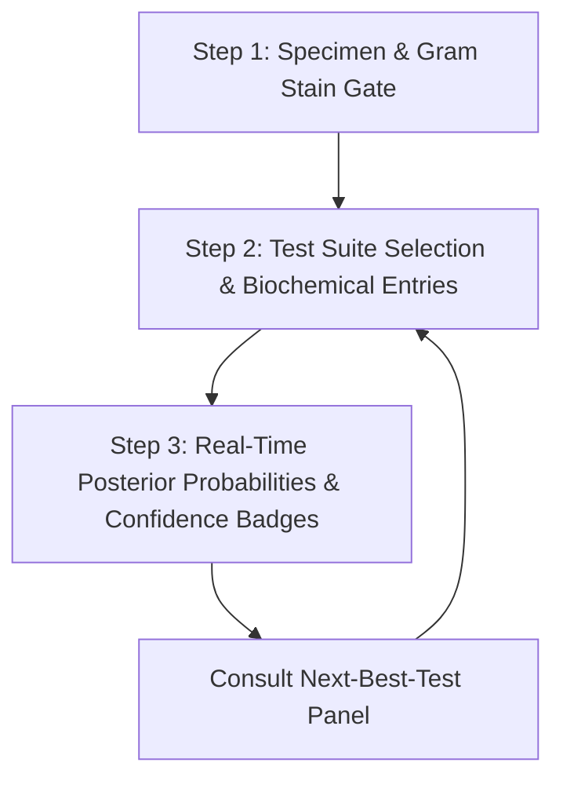

# BokBac User & Workflow Guide

This document provides a guide to the user interface, clinical workflow simulator, and configuration features of the BokBac web application.

---

## 1. Diagnostic Identification Workflow

BokBac guides users through a structured, three-step clinical identification workflow that mirrors real-world laboratory benches.



### Step 1: Specimen Selection & Gram Stain Gate
Users begin by specifying the source specimen (e.g., urine, blood, stool, CSF) and the initial Gram stain observations:
* **Gram Reaction**: Positive, Negative, Variable, or Unknown.
* **Cellular Morphology**: Cocci, Bacilli, Coccobacilli, Curved Rods, Branching Filaments, or Unknown.
* **Arrangement**: Clusters, Chains, Pairs, Diplococci, Palisade, Single, or Unknown.

*Note: Selecting these parameters sets up the gate check described in the [Algorithm Guide](algorithm.md), pruning the candidate species list to prevent diagnostic errors.*

### Step 2: Test Suite Selection
Once the specimen and morphology establish an initial group classification (e.g., Gram-negative rods $\rightarrow$ Enterobacterales), the app selects the appropriate **Test Suite**. A Test Suite is a pre-ordered panel of biochemical tests.

BokBac supports three tiers of Test Suites:
1. **System Default Suites**: Default panels matching national curriculum benchmarks.
2. **Institution Suites**: Custom suites assigned by a specific school or laboratory.
3. **User Custom Suites**: Created by individual users to test specific diagnostic strategies.

### Step 3: Biochemical Test Input
Users record results for the listed tests. The interface accepts:
* `+` or `+ (Positive)`: Characteristic reaction.
* `-` or `- (Negative)`: Absence of reaction.
* `V` or `V (Variable)`: Strains of the species are known to vary.
* **Hemolysis Results**: `alpha`, `beta`, or `gamma` (non-hemolytic) for streptococci and staphylococci.

---

## 2. Interpreting Probabilistic Output

As users input results in Step 2, Step 3 displays a ranked list of candidate species in real time.

```text
+-------------------------------------------------------------+
| Escherichia coli                                       98%  |
| [ HIGH CONFIDENCE ]   Case Fit: 0.96   Evidence Cov: 1.00   |
| Typicality Index: 0.98   Contradictions: 0                  |
+-------------------------------------------------------------+
| Klebsiella pneumoniae                                   1%  |
| [ EXCLUDED ]          Case Fit: 0.00   Evidence Cov: 0.85   |
| Typicality Index: 0.12   Contradictions: 1 (Motility)        |
+-------------------------------------------------------------+
```

### Key UI Indicators

1. **Posterior Probability (%)**: The computed likelihood that the specimen matches this species relative to other candidates in the active group.
2. **Evidence Coverage**: The proportion of answered tests that actually have reference data (MCM or fallback) for this candidate. High probability with low coverage indicates a weak diagnosis.
3. **Typicality Index**: Displays how "typical" the isolate's reactions are compared to the canonical taxon. An isolate showing atypical reactions (e.g., indole-negative *E. coli*) will display a lower Typicality Index.
4. **Confidence Badge**:
   * **HIGH**: Solid diagnosis. Highly distinctive results.
   * **MEDIUM**: Strong candidate, but additional testing is recommended to rule out runners-up.
   * **LOW**: High uncertainty. Too few tests performed or multiple close candidates.
   * **VERY LOW**: Low test coverage, poor case fit, or major contradictions.

---

## 3. Custom Biochemical Test Suites

Educators and advanced users can create custom panels to simulate specific hospital protocols. When creating a custom suite, users define:
* **Group**: The target organism group.
* **Name**: The name of the custom panel.
* **Tests**: An ordered list of biochemical tests.
* **Weights/Overrides**: Custom modifiers for specific tests (e.g., emphasizing a particular test in local epidemiologic contexts).

*Custom suites are stored in the user's browser profile and can be exported as JSON to share with students.*

---

## 4. Saved Cases Framework

To facilitate student practice and case-based learning, BokBac allows users to save active isolate workups. A **Saved Case** stores the complete state of the workspace.

### JSON Schema of a Saved Case

```json
{
  "id": "case_2026_06_10_001",
  "createdAt": "2026-06-10T15:57:32Z",
  "updatedAt": "2026-06-10T15:58:10Z",
  "title": "Stool Specimen Case Study - MT 402",
  "tags": ["stool", "diarrhea", "gram-negative-rod"],
  "note": "Patient presents with watery diarrhea. Gram-negative bacilli isolated.",
  "group": "enterobacterales",
  "initialObservation": {
    "specimen": "stool",
    "gramReaction": "negative",
    "morphology": "bacilli",
    "arrangement": "single"
  },
  "answers": {
    "oxidase": "−",
    "indole": "+",
    "vp": "−",
    "citrate": "−",
    "motility": "+",
    "lactose": "+",
    "h2s": "−"
  },
  "suiteId": "sys_enterobacterales_default",
  "suiteName": "Enterobacterales Default Panel",
  "suiteVersion": "1.1.0",
  "engineVersion": "4.0.0",
  "topSpecies": "e_coli",
  "topPct": 98
}
```

By exporting and importing this JSON file, educators can package predefined cases (e.g., "Atypical Klebsiella Case" or "Vibrio Outbreak Scenario") for classroom demonstrations.

---

## 5. Next-Best-Test Recommendation Panel

The **Next-Best-Test Panel** helps students determine which biochemical test to perform next.

* **List Ordering**: Recommends tests ordered by their **Practical Suitability Score** (derived from Shannon Entropy reduction, incubation time, reagent cost, and suite inclusion).
* **Entropy Reduction Indicator**: Shows the expected percentage reduction in diagnostic uncertainty.
* **Justification String**: Provides an explanation of why the test is recommended (e.g., *"Helps differentiate between Salmonella Paratyphi A and Citrobacter freundii"*).
